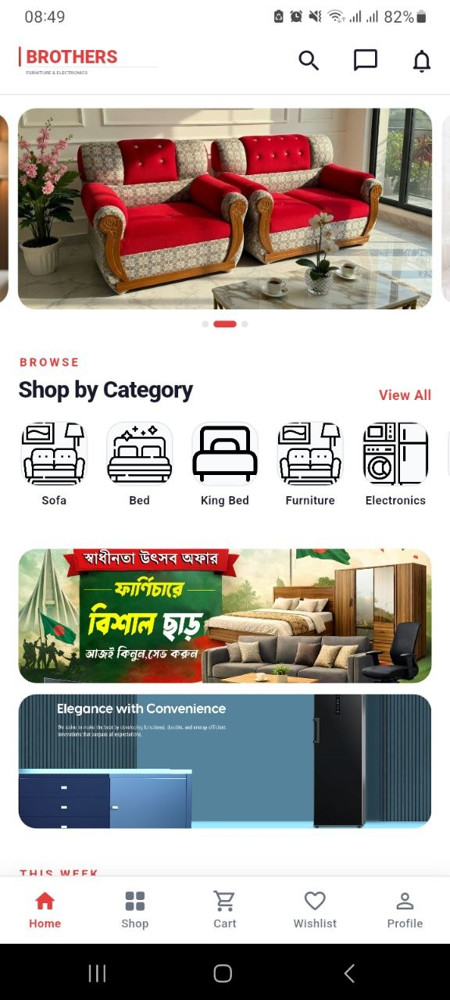
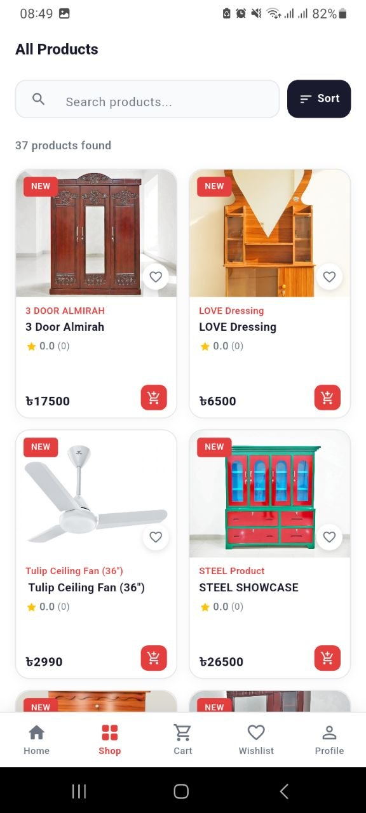
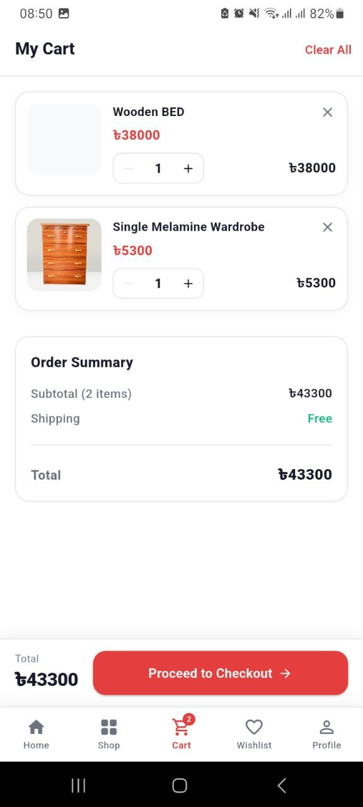
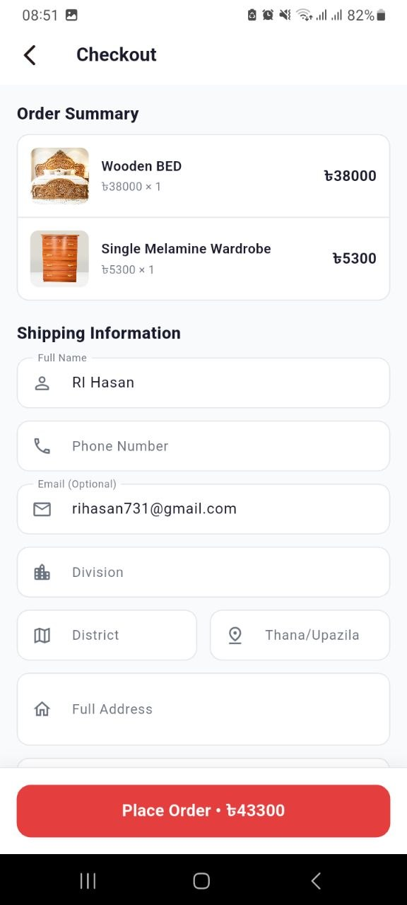
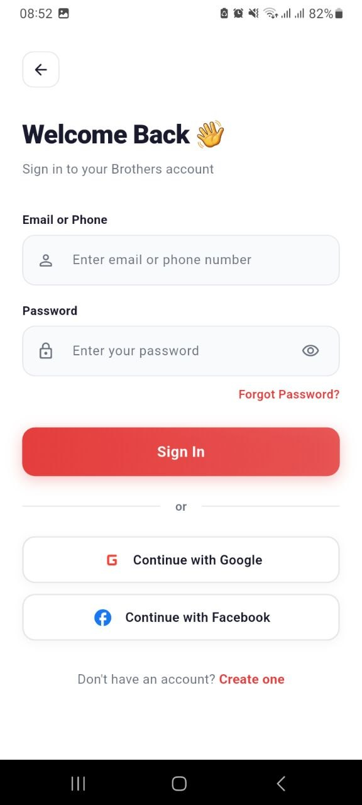
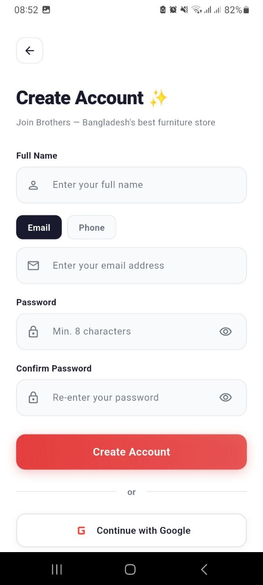
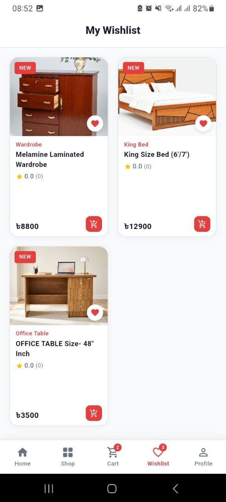
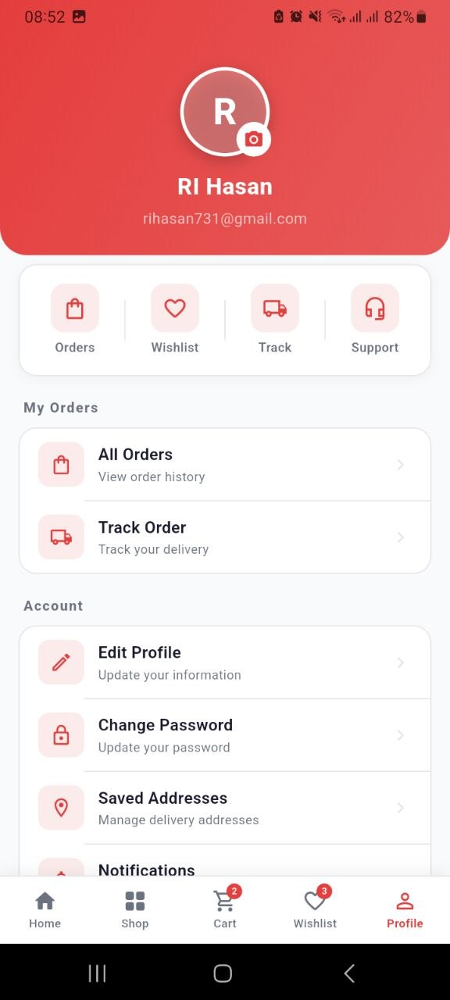
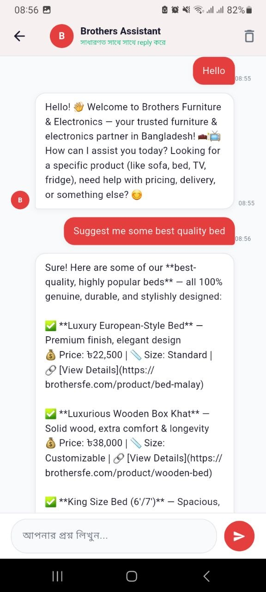

<div align="center">


# 🛋️ Brothers Furniture & Electronics
### Mobile E-Commerce Application

[](https://flutter.dev)
[](https://dart.dev)
[](https://laravel.com)
[](https://riverpod.dev)
[](LICENSE)

**A full-featured Flutter e-commerce app for Brothers Furniture & Electronics — Bangladesh's trusted furniture & electronics retailer.**

[📥 Download APK](https://github.com/HasanSarkar02/brothers-app-update/releases/download/v1.0.1/app-release.apk) • [🌐 Website](https://brothersfe.com) • [📞 Hotline: 01913987555](tel:+8801913987555)

</div>

---

## 📱 Screenshots

<div align="center">

| Home | Shop | Cart | Checkout |
|------|------|------|----------|
|  |  |  |  |

| Login | Register | Wishlist | Profile | Chatbot |
|-------|----------|----------|---------|---------|
|  |  |  |  |  |

</div>

---

## ✨ Features

### 🛍️ Shopping
- Browse products by category (Furniture, Electronics, etc.)
- Real-time search with keyword filtering
- Product detail page with images, variants, and pricing
- Discount badges and sale price display

### 🔐 Authentication
- Email **or** Bangladeshi phone number registration & login
- **Google Sign-In** (OAuth via `google_sign_in`)
- Facebook Login support
- Secure token storage using `flutter_secure_storage`
- Guest cart → auto-merges after login

### 🛒 Cart & Checkout
- Add/remove/update quantities with stock validation
- Guest cart tracked by UUID session (no login required)
- Multiple payment methods: **COD, bKash, Nagad, Rocket, VISA, Mastercard**
- 0% EMI installment support
- Order confirmation with order number

### 🤖 AI Chatbot — "Brothers Assistant"
- Powered by **Qwen LLM** (via OpenRouter)
- Answers in Bengali 🇧🇩 or English based on user input
- Context-aware: searches product database for relevant items
- Quick replies for common questions (delivery, return policy, showrooms)
- Persistent conversation history within session

### ❤️ Wishlist
- Save favourite products locally (`SharedPreferences`) + server-side sync
- Toggle from product list or detail screen
- Works offline

### 📦 Orders
- Full order lifecycle tracking
- Order history with status (Pending → Confirmed → Delivered)
- Order detail view

### 👤 Profile
- View & edit personal information
- Avatar upload support
- Clean logout with token revocation

---

## 🏗️ Architecture

This app uses a **Feature-first + Layered** architecture with [Riverpod](https://riverpod.dev) for state management.

```
lib/
├── main.dart                        # App entry point (ProviderScope)
│
├── core/                            # Shared infrastructure
│   ├── api/
│   │   └── dio_client.dart          # Singleton HTTP client with interceptors
│   ├── constants/
│   │   ├── api_constants.dart       # Base URL, storage URL
│   │   └── app_colors.dart          # Design system colors
│   ├── exceptions/
│   │   ├── api_exception.dart       # Custom exception class
│   │   └── api_error_handler.dart   # Error parsing utility
│   ├── router/
│   │   └── app_router.dart          # GoRouter config (ShellRoute + full-screen)
│   ├── services/
│   │   └── update_service.dart      # App update checker
│   └── storage/
│       └── local_storage.dart       # SecureStorage + SharedPreferences wrapper
│
├── features/                        # Feature modules
│   ├── auth/                        # Login, Register, Social Login
│   │   ├── models/auth_model.dart
│   │   ├── providers/auth_provider.dart
│   │   ├── repository/auth_repository.dart
│   │   └── screens/
│   ├── cart/                        # Cart management
│   ├── chat/                        # AI Chatbot
│   ├── checkout/                    # Order placement & confirmation
│   ├── home/                        # Home feed, banners, categories
│   ├── orders/                      # Order history & tracking
│   ├── product/                     # Product list & detail
│   ├── profile/                     # User profile
│   ├── search/                      # Search screen
│   └── wishlist/                    # Wishlist
│
└── shared/
    └── widgets/
        ├── main_scaffold.dart       # Bottom nav bar wrapper
        └── social_login_buttons.dart
```

### Data Flow
```
Screen (UI)
  └── watches/reads Provider (Riverpod)
        └── calls Repository
              └── calls DioClient (Dio + Interceptor)
                    └── Laravel REST API  ←→  Qwen AI / Google OAuth
```

---

## 🛠️ Tech Stack

| Layer | Technology | Purpose |
|-------|-----------|---------|
| UI | **Flutter 3.x** | Cross-platform Android & iOS |
| State | **Riverpod (flutter_riverpod)** | Global state management |
| HTTP | **Dio** | API calls with interceptors |
| Navigation | **GoRouter** | Declarative routing |
| Auth | **flutter_secure_storage** | Encrypted token storage |
| Local DB | **SharedPreferences** | Wishlist, guest session, user cache |
| Social Login | **google_sign_in** | Google OAuth |
| Backend | **Laravel + Sanctum** | REST API & token auth |
| AI | **Qwen (OpenRouter)** | Chatbot LLM |
| Responsive | **flutter_screenutil** | Adaptive UI (base: 390×844) |
| Font | **Outfit** (Google Fonts) | App-wide typography |

---

## ⚙️ Getting Started — VS Code Setup

### Prerequisites

Make sure you have the following installed:

| Tool | Version | Download |
|------|---------|---------|
| Flutter SDK | 3.x (stable) | [flutter.dev/docs/get-started](https://flutter.dev/docs/get-started/install) |
| Dart SDK | Included with Flutter | — |
| Android Studio | Latest | [developer.android.com](https://developer.android.com/studio) (for emulator/SDK) |
| VS Code | Latest | [code.visualstudio.com](https://code.visualstudio.com) |
| Git | Any | [git-scm.com](https://git-scm.com) |

### VS Code Extensions (Required)

Install these from the VS Code Extensions marketplace (`Ctrl+Shift+X`):

- **Flutter** — `Dart-Code.flutter`
- **Dart** — `Dart-Code.dart-code`
- **Pubspec Assist** — `jeroen-meijer.pubspec-assist` *(optional but helpful)*
- **Error Lens** — `usernamehw.errorlens` *(optional — highlights errors inline)*

---

### 📥 Step-by-Step Installation

#### 1. Clone the Repository

```bash
git clone https://github.com/HasanSarkar02/brothers-shop-app.git
cd brothers-shop-app
```

#### 2. Open in VS Code

```bash
code .
```

Or open VS Code → **File** → **Open Folder** → select the cloned folder.

#### 3. Install Dependencies

Open the integrated terminal in VS Code (`Ctrl + `` ` ```) and run:

```bash
flutter pub get
```

#### 4. Configure Environment

The API base URL is already set to the live backend. No `.env` file is needed for running the app.

If you want to point to a local backend, edit:

```dart
// lib/core/constants/api_constants.dart
class ApiConstants {
  static const String baseUrl = 'https://brothersfe.com/api/v1'; // ← change this
  static const String storageUrl = 'https://brothersfe.com/storage';
}
```

#### 5. Google Sign-In Setup (Optional — for development)

If you're developing and need Google Sign-In:

1. Go to [Google Cloud Console](https://console.cloud.google.com)
2. Create a project → Enable **Google Sign-In API**
3. Download `google-services.json` → place in `android/app/`
4. Your SHA-1 fingerprint must be registered in the Firebase/Google project

> **Note:** The production app already has this configured. This step is only needed if you create your own Firebase project.

#### 6. Run the App

Connect a device or start an emulator, then:

```bash
# Check connected devices
flutter devices

# Run in debug mode
flutter run

# Run on a specific device
flutter run -d <device-id>

# Run in release mode
flutter run --release
```

**In VS Code:** Press `F5` or click **Run → Start Debugging**. Select your device from the status bar at the bottom.

---

### 🔨 Build APK

```bash
# Debug APK
flutter build apk --debug

# Release APK (optimized)
flutter build apk --release

# Split APKs by ABI (smaller file sizes)
flutter build apk --split-per-abi --release
```

Output path: `build/outputs/flutter-apk/app-release.apk`

---

### 🐛 Common Issues & Fixes

| Issue | Fix |
|-------|-----|
| `flutter pub get` fails | Run `flutter clean` then `flutter pub get` |
| Gradle build error | Make sure Android SDK is installed via Android Studio |
| `sdk` version mismatch | Run `flutter upgrade` to update Flutter |
| Google Sign-In not working | Check `google-services.json` is in `android/app/` |
| Emulator too slow | Enable hardware acceleration (HAXM/Hyper-V) in BIOS |
| `flutter devices` shows nothing | Enable USB debugging on your Android phone |

---

## 🌐 API Reference

**Base URL:** `https://brothersfe.com/api/v1`

All authenticated endpoints require:
```
Authorization: Bearer <sanctum_token>
```

| Method | Endpoint | Auth | Description |
|--------|----------|------|-------------|
| `POST` | `/register` | ❌ | Register (email or phone) |
| `POST` | `/login` | ❌ | Login with identifier + password |
| `POST` | `/social-login` | ❌ | Google / Facebook OAuth |
| `POST` | `/logout` | ✅ | Revoke current token |
| `GET` | `/me` | ✅ | Get current user info |
| `GET` | `/products` | ❌ | Product list (with filters) |
| `GET` | `/products/{slug}` | ❌ | Product detail |
| `GET` | `/categories` | ❌ | All categories |
| `GET` | `/cart` | ❌* | Fetch cart |
| `POST` | `/cart` | ❌* | Add to cart |
| `PUT` | `/cart/{id}` | ❌* | Update cart item |
| `DELETE`| `/cart/{id}` | ❌* | Remove cart item |
| `GET` | `/wishlist` | ✅ | Get wishlist |
| `POST` | `/wishlist` | ✅ | Add to wishlist |
| `POST` | `/checkout` | ✅ | Place order |
| `GET` | `/orders` | ✅ | Order history |
| `POST` | `/chat` | ❌ | AI chatbot message |
| `GET` | `/chat/quick-replies` | ❌ | Predefined quick replies |

> `❌*` = Guest access supported via `X-Guest-Session` header

---

## 📦 Key Dependencies

```yaml
# State Management
flutter_riverpod: ^2.x

# HTTP & Networking
dio: ^5.x

# Navigation
go_router: ^14.x

# Auth & Storage
flutter_secure_storage: ^9.x
shared_preferences: ^2.x
google_sign_in: ^6.x

# UI & Responsive
flutter_screenutil: ^5.x
cached_network_image: ^3.x
carousel_slider: ^5.x

# Utilities
uuid: ^4.x
intl: ^0.19.x
```

---

## 📂 Project Structure — Quick Reference

```
Each feature follows this pattern:
  feature/
  ├── models/       → Data classes (fromJson / toJson)
  ├── repository/   → API calls (DioClient)
  ├── providers/    → Riverpod StateNotifier (state logic)
  └── screens/      → Flutter UI widgets
```

---

## 🏪 About Brothers Furniture & Electronics

| Info | Details |
|------|---------|
| 🏢 Owner | Abu Bakar Siddique Uzzal |
| 📍 Head Office | Shailat Road, Jainabazar, Sreepur, Gazipur |
| 📞 Hotline | 01913987555 |
| 💬 WhatsApp | 01929123111 |
| 📧 Email | info@brothersfe.com |
| 🌐 Website | [brothersfe.com](https://brothersfe.com) |
| 🕐 Hours | Sat–Fri, 9AM–10PM |
| 📅 Est. | 2010 |

### Showrooms
| Branch | Location | Phone |
|--------|----------|-------|
| Jainabazar (Main) | Sreepur, Gazipur | 01929123111 |
| Masterbari | Jamirdia, Valuka, Mymensingh | 01924009397 |
| Borachala | Jainabazar, Sreepur, Gazipur | 01918902451 |
| Kashor Bazar | Valuka, Mymensingh | 01956530210 |

---

## 📲 Download

[](https://github.com/HasanSarkar02/brothers-app-update/releases/download/v1.0.1/app-release.apk)

**Requirements:** Android 5.0+ (API level 21)

> Enable **"Install from unknown sources"** in your Android settings before installing.

---

## 🤝 Contributing

1. Fork the repository
2. Create a feature branch: `git checkout -b feature/your-feature`
3. Commit your changes: `git commit -m 'Add some feature'`
4. Push to the branch: `git push origin feature/your-feature`
5. Open a Pull Request

---

## 📄 License

This project is licensed under the **MIT License** — see the [LICENSE](LICENSE) file for details.

---

<div align="center">

Made with ❤️ using Flutter · Powered by [Brothers Furniture & Electronics](https://brothersfe.com)

</div>
